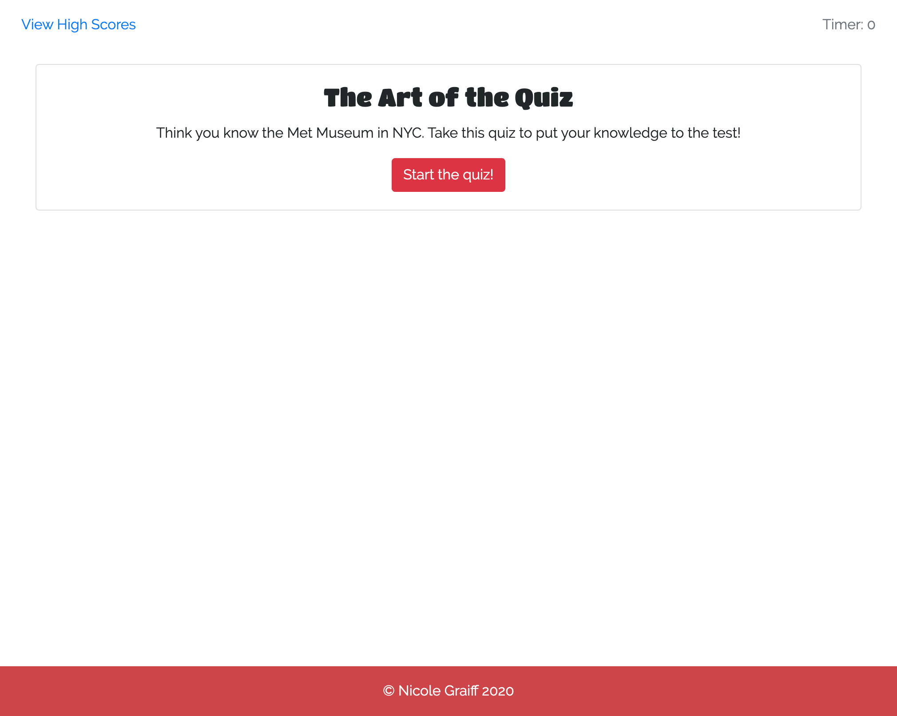
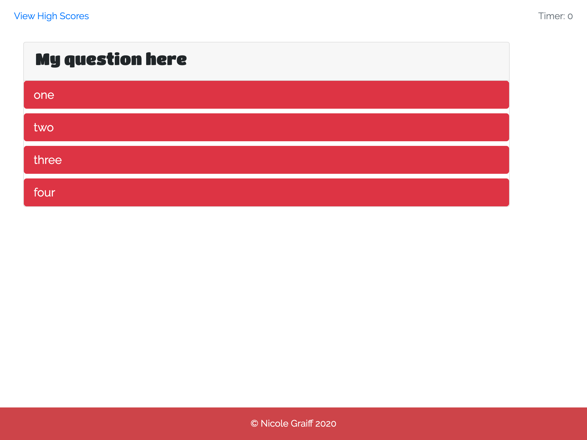
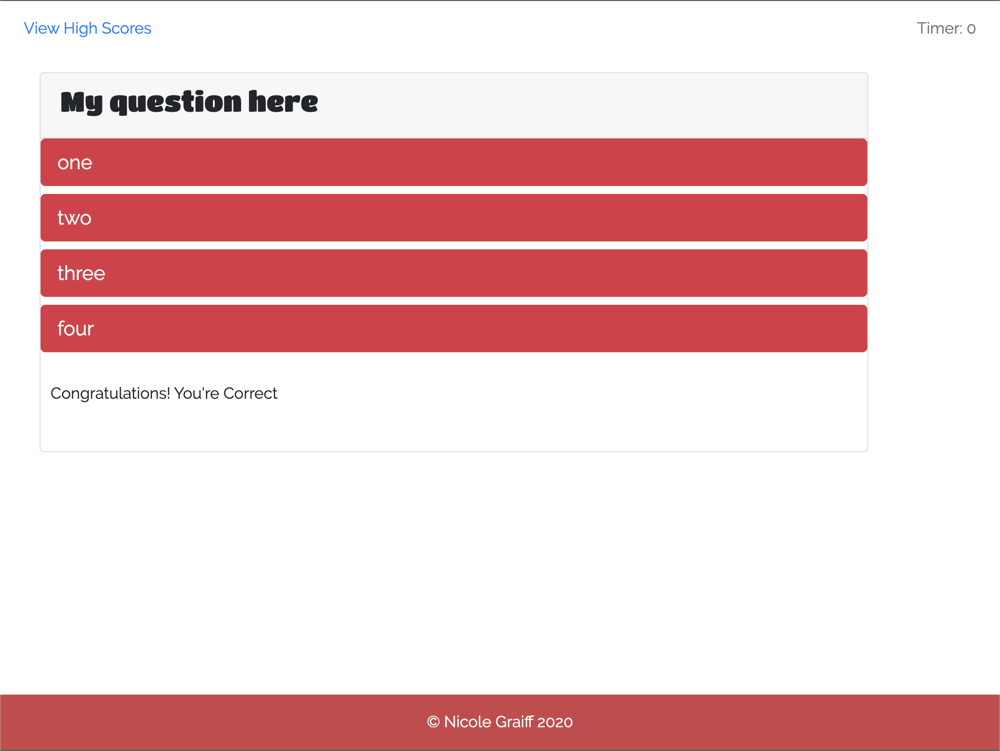
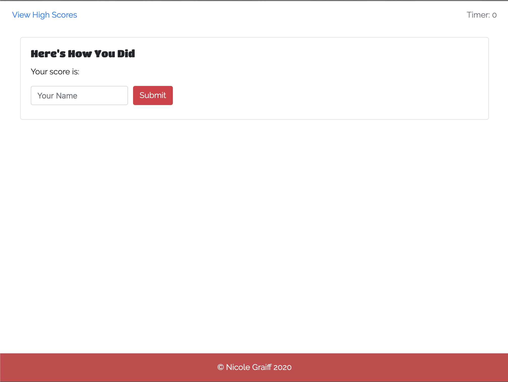
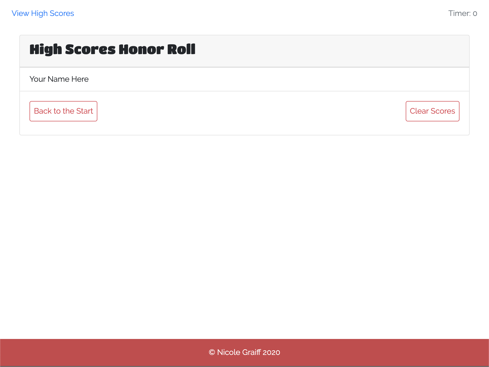

# code-quiz
Work Still In Progress: https://keycole.github.io/code-quiz/

A timed code quiz with multiple-choice questions. This app runs in the browser and features dynamically updated HTML and CSS powered by JavaScript code. It also features a clean and polished user interface. The app is responsive, ensuring that it adapts to multiple screen sizes.

When functioning, the quiz flow should look like this. 
(Screenshots for mobile and tablet devices will be included when the app is functional).

## Start Screen

## Questions Screen

## Answer Check Screen

## Results Screen

## High Score Screen
